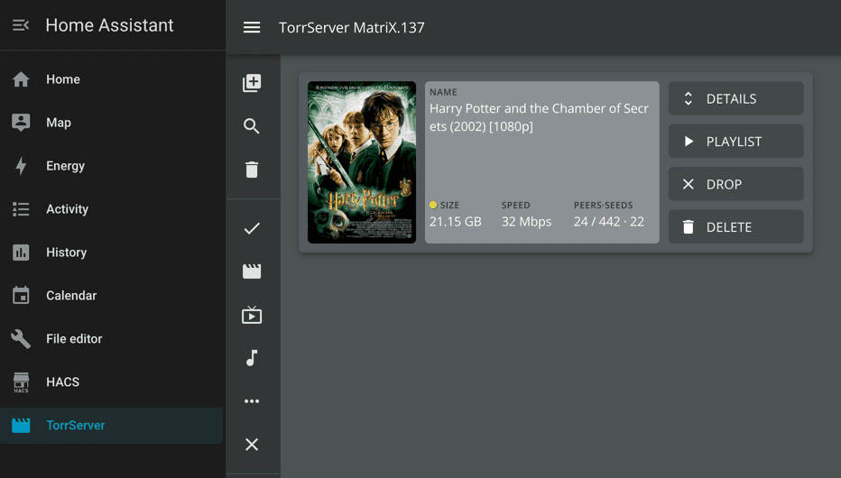

# TorrServer addon for Home Assistant

This is a TorrServer for Home Assistant.

🌟 Please consider supporting [this project](https://github.com/aatrubilin/hassio-torrserver) by giving it a star.

This project based on [https://github.com/YouROK/TorrServer](https://github.com/YouROK/TorrServer)

## Installation

> - Or, navigate in your Home Assistant frontend to
  <kbd>Settings</kbd> -> <kbd>Add-ons</kbd> -> <kbd>Add-on Store (Bottom Right)</kbd>.
> - Click the 3-dots menu at upper right <kbd>...</kbd> > <kbd>Repositories</kbd>
    and add this repository's URL:
> - `https://github.com/aatrubilin/hassio-torrserver`

- Reload the page, scroll to the bottom to find the new repository,
   and click the new add-on named "TorrServer" (refresh the cache if it doesn't appear)

- Click <kbd>Install</kbd> and give it a few minutes to finish downloading.

- Click <kbd>Start</kbd>, give it a few seconds to spin up, and then click the `Open Web UI` button that appears.

## Support

Got questions or problems?

You can [open an issue here](https://github.com/aatrubilin/hassio-torrserver/issues) GitHub.

## Star History

## Authors & contributors

The original TorrServer is developed by [@YouROK](https://github.com/YouROK).
For more information please visit this page: [YouROK/TorrServer](https://github.com/YouROK/TorrServer)

The hassio addon is brought to you by [@aatrubilin](https://github.com/aatrubilin).

## License

[GNU General Public License v3.0](LICENSE)
