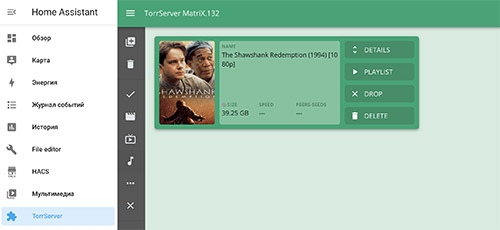

# TorrServer addon for Home Assistant

This is a TorrServer for Home Assistant.



This project based on [https://github.com/YouROK/TorrServer](https://github.com/YouROK/TorrServer)

## Installation

1. Navigate in your Home Assistant frontend to
   <kbd>Settings</kbd> -> <kbd>Add-ons</kbd> -> <kbd>Add-on Store (Bottom Right)</kbd>.

2. Click the 3-dots menu at upper right <kbd>...</kbd> > <kbd>Repositories</kbd>
   and add this repository's URL:
   ```shell
   https://github.com/aatrubilin/hassio-torrserver
   ```

3. Reload the page, scroll to the bottom to find the new repository,
   and click the new add-on named "TorrServer" (refresh the cache if it doesn't appear)

4. Click <kbd>Install</kbd> and give it a few minutes to finish downloading.

5. Click <kbd>Start</kbd>, give it a few seconds to spin up, and then click the `Open Web UI` button that appears.

## Support

Got questions or problems?

You can [open an issue here](https://github.com/aatrubilin/hassio-torrserver/issues) GitHub.

## Authors & contributors

The original TorrServer is developed by [@YouROK](https://github.com/YouROK).
For more information please visit this page: [YouROK/TorrServer](https://github.com/YouROK/TorrServer)

The hassio addon is brought to you by [@aatrubilin](https://github.com/aatrubilin).

[](https://www.tinkoff.ru/cf/4XGa2r5t6OW)

## License

[GNU General Public License v3.0](LICENSE)
